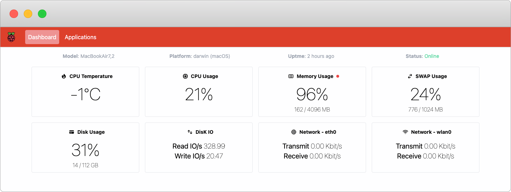

# Raspberry PI Monitoring Dashboard



## Setup on the Raspberry Pi

### Testing the Code

- Install nodejs on your pi using the below command

  ```bash
  sudo apt update
  sudo apt-get install nodejs
  sudo apt-get install npm
  ```
  
- Install nodejs on your pi using the below command

  ```bash
  sudo apt update
  sudo apt-get install git
  ```
  
- Then clone the repo

  ```bash
  mkdir ~/PiDash
  cd ~/PiDash
  git clone https://github.com/babanomania/PiDash.git
  ```

- Run the nodejs server and test

  ```bash
  npx next build
  npx next start -p 8080
  ```

  Then, Open [http://192.168.0.104:3000](http://192.168.0.104:3000) with your browser where 192.168.0.104 is your PI's ip.

- To Start the server on a different path say 8181 use the below commands

  ```bash
  npx next build
  npx next start -p 8181
  ```

  Then, Open [http://192.168.0.104:8181](http://192.168.0.104:8181) with your browser where 192.168.0.104 is your PI's ip.

### Setting it as a Service

- Create a PiDash.service file as below

  ```
  [Unit]
  Description=PiDash Service
  After=network.target

  [Service]
  WorkingDirectory=/home/pi/PiDash
  ExecStart=/usr/bin/npx next start -p 8080
  Restart=on-failure
  User=pi

  [Install]
  WantedBy=multi-user.target
  ```
  
- Now copy this file to the /etc/systemd/system directory
  
    ```bash
    sudo cp timestamp.service /etc/systemd/system
    
- Then enable the service
  
    ```bash
    sudo systemctl enable PiDash.service
    ```
    
- Viewing Service Logs
    
    Instead of logging to standard out on the console, systemd is now managing our service’s logging. Logs can be viewed as follows

    ```bash
    journalctl -u PiDash
    ```
    
That's it! Your PiDash service is currently up and running and in case of a restart it will start automatically when the system boots.
